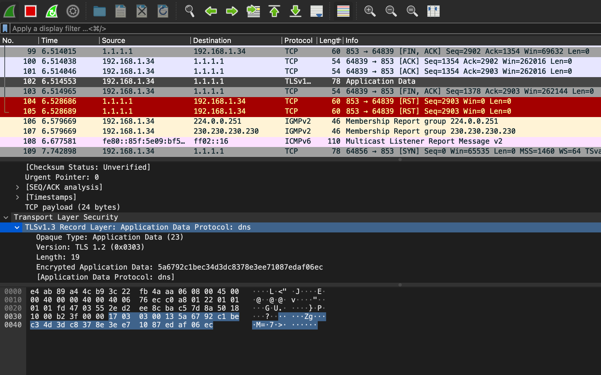

# Stub - Pedro Romero

## What is it?

A proxy from DNS requests TCP or UDP To DoT

## Getting started

### Docker 

Run the following command to build this image:
```
docker build -t stub .
```

Here's an example running its image and mapping the 53 TCP and UDP port on the same ports on the docker host:
```
docker run --rm  --name stub -itp 53:53 -p 53:53/UDP stub
```
### Running manually

After that, try the server:
For UDP Request:
```
 docker run -it --dns=$(docker inspect --format '{{ .NetworkSettings.IPAddress }}' stub) lestienne/kdig:latest -d @172.17.0.2  www.google.es
```

For TCP Request:
```
 docker run -it --dns=$(docker inspect --format '{{ .NetworkSettings.IPAddress }}' stub) lestienne/kdig:latest -d @172.17.0.2  www.google.es +tcp
```

You will have the output of Cloudflare after executing internally a DoT

You can see it here 

## Implementation details

*Note: due lack of time, I doesn't handle properly errors and doesn't perform internal tests on code tests*

I have chosen Golang even i am not an expert to deliver with TCP/UDP connections as it is better than Python to manage them.
Also, it is easily split services with goroutines.

* Security: Even this will prevent you to typical spoofing attacks, if we need to assure all our requests are using DoT, we need to modify the DNS Nameserver on our root DNS Resolvers. 
Also we should think if we need to implement strict mode or opportunistic in order to satisfy our requirements. Finally, I will implement a Firewall or another technology in order to choose who can use the proxy.
  
* Microservices Infrastructure: Thinking on Kubernetes, we should deploy our infrastructure as a Daemonset and Configure our DNS Server (CoreDNS mainly) to forward all the DNS requests from our Kubernetes server to our DNS DoT Service.

* Improvements: As my service is using 2 Servers, TCP and UDP, the first think that I would improve, is to try to manage them on 1 Server. Also, as DoT increases the latency of the DNS Requests,
I would try to improve it, and finally, in order to avoid unnecessary requests, I would try to cache the requests on the server and expire them after a period. 
  Also would be great to use contexts with timeouts instead waitgroups to manage the goroutines. Finally as due lack of time I used different functions to manage UDP and TCP connections to DoT Server, would be great if it can be managed by only 1.